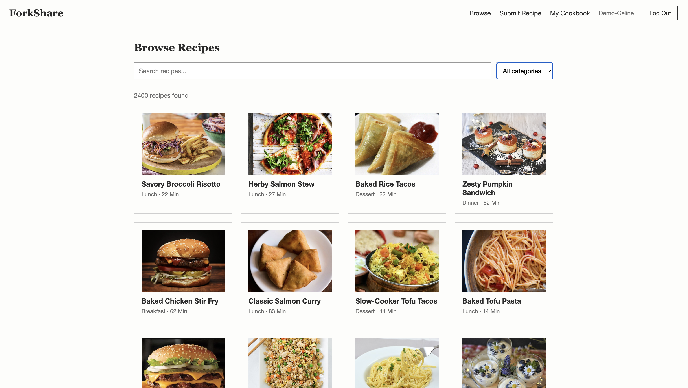

# ForkShare

A full-stack recipe sharing web application for home cooks. Users create an account, submit recipes with ingredients, steps, prep time, and a category, browse and filter recipes by keyword/category/max prep time, and save recipes to a personal cookbook with their own notes.

## Author

- Celine Isaacs
- Claire Stanton

## Class Link

[Web Development — Northeastern University](https://webdev-online-neu.slack.com/archives/C09D5UFRT2R)

## Project Objective

ForkShare was built as Project 3 for our Web Development course. The goal was to build a full-stack, client-side rendered React application backed by Node, Express, and MongoDB (native driver, no Mongoose), with Passport-based authentication, demonstrating full CRUD across multiple collections split between two team members.

- **Celine** implemented authentication (register/login/logout/session via Passport) and full CRUD on the `recipes` collection (create, edit, delete recipes).
- **Claire** implemented the browse/search/filter experience and full CRUD on the `cookbook` collection (save, update notes/ratings, remove saved recipes).

## Screenshot


## Tech Stack

- **Frontend:** React (Hooks), Vite, React Router
- **Backend:** Node.js, Express
- **Database:** MongoDB (native NodeJS driver — no Mongoose)
- **Auth:** Passport (local strategy) with server-side sessions

## Instructions to Build & Run

### Prerequisites

- Node.js (v20 or v22 LTS recommended)
- MongoDB running locally, **or** a MongoDB Atlas connection string
- npm

### 1. Clone the repo

```bash
git clone https://github.com/isaac650/ForkShare.git
cd ForkShare
```

### 2. Set up the backend

```bash
cd backend
npm install
cp .env.example .env


Edit `.env` with your own values:

```

MONGO_URI=mongodb://localhost:27017/forkshare
SESSION_SECRET=your-own-random-string-here
PORT=3000

````

(If using MongoDB Atlas instead of local Mongo, replace `MONGO_URI` with your Atlas connection string, including the database name, e.g. `mongodb+srv://<user>:<password>@<cluster>.mongodb.net/forkshare?retryWrites=true&w=majority`.)

Start the backend:

```bash
npm run dev
````

You should see:

```
Connected to MongoDB (forkshare database)
ForkShare backend running on http://localhost:3000
```

### 3. Set up the frontend

In a separate terminal:

```bash
cd frontend
npm install
npm run dev
```

Vite will start on `http://localhost:5173` and proxy `/api` requests to the backend on port 3000.

### 4. Use the app

Open `http://localhost:5173` in your browser. Register an account, submit a recipe, browse, and save recipes to your cookbook.

## Public Deployment

- **Live URL:** [https://forkshare-4kb5.onrender.com/](https://forkshare-4kb5.onrender.com/)

## License

This project is licensed under the MIT License — see [LICENSE](./LICENSE) for details.
